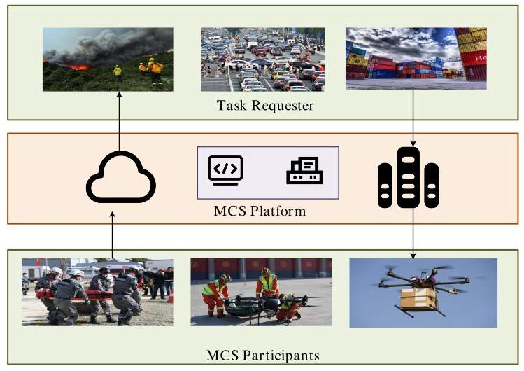
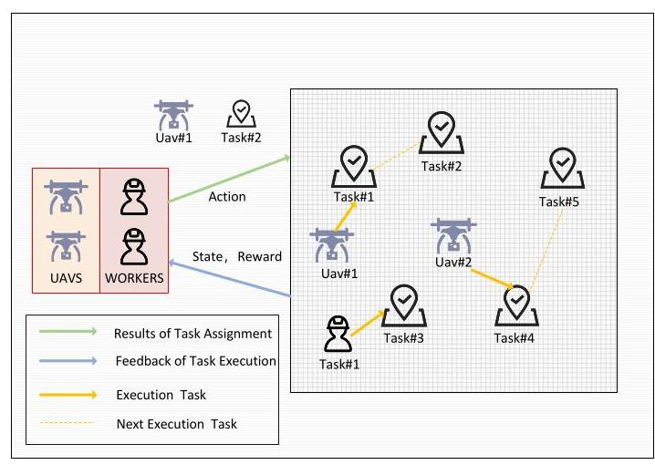
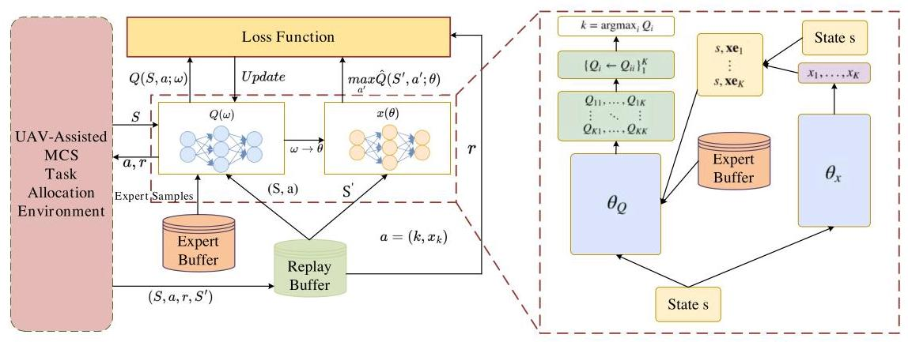
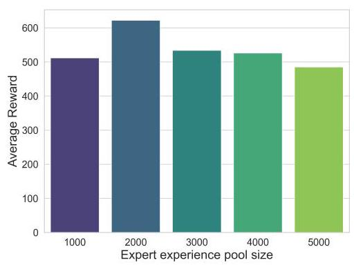
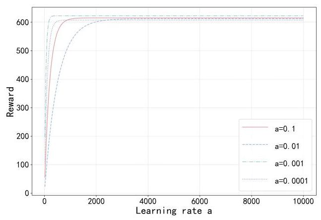
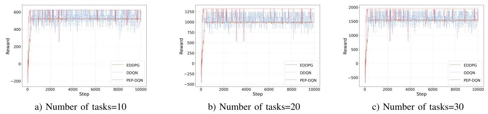
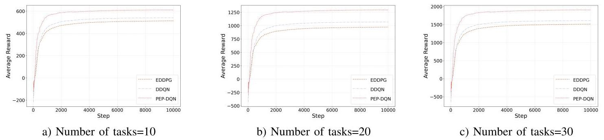
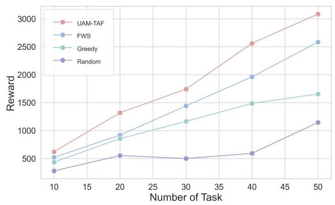
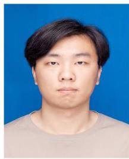

# Hybrid Action Space Based Reinforcement Learning Framework for UAV-Assisted MCS Task Assignment

Guisong Yang, Member, IEEE, Xudong Zhang, Xingyu He, Member, IEEE, Fanglei Sun, Member, IEEE, Yunhuai Liu

Abstract-In recent years, Mobile Crowd Sensing (MCS) has emerged as a research hotspot, offering an innovative mode of perception widely applied in areas such as intelligent transportation and environmental monitoring by utilizing mobile devices for data collection and information analysis. However, traditional UAV-assisted mobile crowd sensing struggles to fully meet the diverse objectives of large-scale perception tasks, particularly in specialized environments. To address this, this paper proposes a UAV-assisted mobile crowd sensing task assignment framework(UAM-TAF) based on reinforcement learning. First, in order to realize UAM-TAF, we introduces a Multi-Objective Task assignment Goal (MOTGO) that innovatively accounts for factors such as cost, task scale, perception cost, and task diversity. Second, to achieve MOTGO with greater efficiency and precision, a novel task assignment strategy based on reinforcement learning. In this strategy, the Priority and Expert Parametrized Deep Q-Network (PEP-DQN) is developed, building upon an enhanced P-DQN model for human-computer collaboration. Having optimized the action parameter selection space in PEP-DQN to address the challenges of efficient continuous parameter selection and hybrid action space optimization. This approach effectively harnesses the complementary capabilities of human workers and UAV to improve the completion rate and efficiency of perception tasks. Experimental results demonstrate that, compared to existing algorithms, The proposed framework has an improvement in perceived gain in the range of \( {15}\%  - {25}\% \) and converges faster and more consistently, based on considerations of equipment cost, task size, perception cost, and task variability. This provides a novel solution in the field of UAV-assisted mobile crowd sensing.

Index Terms-Mobile crowd sensing, Deep reinforcement learning, Task assignment, UAV-Assisted, Hybrid Action Space

## I. INTRODUCTION

\( \mathrm{N} \) recent years, Mobile Crowd Sensing (MCS) has become a key research focus as a new approach to environmental sensing, data collection, and information services. MCS creates an interactive sensing network using mobile devices, where tasks are assigned to individuals or groups for data collection, analysis, and knowledge sharing. Although related concepts like participatory sensing, voluntary sensing, and urban sensing differ in focus, they all involve human-assisted mobile devices for data collection and knowledge discovery. Participatory sensing was first introduced by Estrin, enabling professionals to leverage mobile devices for local knowledge sharing.MCS is applied in fields such as intelligent transportation, public safety, social recommendations, environmental monitoring, and urban management. Task assignment, a core MCS component, involves selecting mobile terminals to meet task requirements, optimizing assignment algorithms, and designing user incentive mechanisms. Addressing these challenges is a central research focus in MCS.

As MCS applications grow, the number and diversity of tasks increase. However, certain specialized tasks, such as environmental quality monitoring, cannot be reliably completed by human workers alone. These tasks, critical for smart cities and pollution management, often occur in specialized environments like industrial parks or flood-prone areas, where ordinary mobile users cannot perform sensing due to capacity limitations, leading to data gaps. With limited mobile users and constrained sensing capabilities, incentivizing participation becomes necessary, raising sensing costs.

Unmanned intelligent devices possess significantly enhanced sensing capabilities compared to traditional mobile devices. As a typical unmanned device, UAV can provide more diverse and comprehensive sensing data (e.g., aerial perspectives) than traditional mobile devices. UAV also enable standardized sensing processes, avoiding the inconsistent quality of human-collected data. Furthermore, UAV offer the advantage of performing life-threatening or repetitive tasks, are easy to control centrally, and do not require complex incentive mechanisms. As a result, UAV are increasingly adopted in disaster rescue [1], surveillance, and environmental monitoring [2][3]. Introducing UAV into MCS systems as task performers addresses the limitations of human workers and enhances task completion efficiency in specialized environments.

While UAV offer significant advantages over human workers, their high cost limits their adoption compared to traditional mobile devices. MCS typically involves large-scale data collection, such as environmental monitoring, which requires substantial sensing data. However, UAV face limitations in energy, availability, and budget constraints, making them impractical for large-scale tasks due to higher sensing costs.

---

This work was supported in part by the National Natural Science Foundation of China under Grants 61802257 and 61602305, and in part by the Natural Science Foundation of Shanghai under Grants 18ZR1426000 and 19ZR1477600.(Corresponding author: Fanglei Sun).

Guisong Yang is with the Department of Computer Science and Engineering and Agile , University of Shanghai for Science and Technology, Shanghai 200093, China (e-mail: gsyang@usst.edu.cn).

Xudong Zhang is with the Department of Computer Science and Engineering, University of Shanghai for Science and Technology, Shanghai 200093, China (e-mail: mailto:222320573@st.usst.edu.cn222320573@st.usst.edu.cn).

Xingyu He is with the Department of Computer Science and Engineering and Department of Publishing, University of Shanghai for Science and Technology, Shanghai 200093, China (e-mail: xy he@usst.edu.cn).

Fanglei Sun is with the Department of Computer Science and Engineering, University of Shanghai for Science and Technology, Shanghai 200093, China (e-mail: sunfanglei@usst.edu.cn).

Yunhuai Liu is with the Department of Computer Science and Engineering, Peking University, Beijing 100871, Peking University Chongqing Research Institute of Big Data, Chongqing 400039, China (e-mail: yun-huai.liu@pku.edu.cn).

---

Existing research on UAV-assisted mobile crowd sensing primarily focuses on using UAV for path planning and data calibration, overlooking their potential in crowd sensing tasks. Current human-robot collaborative frameworks also tend to have singular objectives and fail to address UAV-worker heterogeneity, including task diversity, energy constraints, and deployment challenges. As MCS is applied in larger-scale scenarios, there is an increasing need for advanced UAV-assisted task assignment algorithms to manage these complexities.Moreover, the algorithms commonly employed in current related research, such as DDQN and PDQN, face several challenges. These include the efficient selection of continuous parameters, optimization in hybrid action spaces, the cold-start issue, and the problem of maintaining training sample parity.

We address the problem of collaborative task assignment between human workers and UAV in mobile crowd sensing scenarios. The movement patterns, task preferences, completion quality, and costs differ significantly between UAV and workers. For instance, workers often exhibit specific preferences for certain types of tasks due to self-interest, and variations in their sensing capabilities lead to differences in the quality of data submitted. In contrast, UAV, as unmanned intelligent devices, possess uniform sensing abilities, ensure a standardized sensing process, and do not have specific task preferences.

In this paper, we propose the UAM-TAF framework to address these challenges. Within this framework, we firsty propose MOTGO, which aims to enhance human-computer collaborative task assignment compared to traditional task assignment algorithms. Main elements of PEP-DQN improvement include the optimization of the action parameter selection space, the integration of a priority replay buffer mechanism, and the use of expert samples to improve the performance of P-DQN. MOTGO is efficiently implemented through the enhanced P-DQN algorithm, PEP-DQN, which leverages the complementary strengths of UAVs and human workers to increase the completion rate of sensing tasks while reducing costs. The main contributions of this paper are as follows:

- In this paper, we design a UAV-assisted MCS perception framework (UAM-TAF) that optimizes the assignment of MCS workers and UAV to enhance the framework's overall sensing capabilities. UAM-TAF addresses the challenges of task size requirements and perception costs in traditional MCS task assignment by implementing an efficient task assignment strategy.

- In UAM-TAF, we formalize the UAV-assisted mobile crowd sensing task assignment problem as a multi-objective optimization problem, proposesa multi-objective task assignment criterion (MOTGO), modeling problems with hybrid spatial reinforcement learning with the objective defined as a weighted sum of cost and perceived quality.

- In order to more efficiently realize MOTGO, and solve the problem of action coupling in hybrid action space, we innovatively propose an improved hybrid action space algorithm PEP-DQN and experimentally validate it, the improved hybrid action space processing effectively improves the algorithm efficiencyand the results demonstrate that our algorithm reduces the weighted sum of cost and perceived quality by \( {15}\%  - {25}\% \) compared to other algorithms.

The remainder of this paper is organized as follows. Section II summarizes existing related studies. Section III introduces the proposed system model and problem definition. A task assignment strategy based on PEP-DQN human-machine collaboration is discussed in Section IV. Section V gives the performance evaluation via analysis of the simulation results. Finally, conclusions are drawn in Section VI.

## II. RELATED WORK

## A. Task assignment Methods for Mobile Crowd Sensing

With the widespread application of MCS, task assignment has become a key research focus. The task assignment problem involves selecting the most suitable mobile users for sensing tasks, aiming to optimize task quality, maximize profit, and minimize costs. The authors in [4] address the issue of the platform's lack of prior knowledge about participants' task capabilities, proposing a single-task assignment method that models participant recruitment as a multi-armed bandit problem.The authors [5] propose a single-task assignment method that reduces overall costs and enhances data quality by following three steps-information modeling, cost estimation, and task assignment. The authors[6] consider multi-dimensional task diversity to design a task assignment approach, formulating both platform-centric and participant-centric auction mechanisms to recruit participants and calculate payments. The authors [7] recognize that MCS tasks are often time-sensitive and location-dependent, and thus propose an assignment method that incorporates task information such as time and location. The authors[8] design a task recommendation system that matches tasks to participants based on their preferences and reliability, the authors [9]] proposes a similar task assignment method also focused on participant preferences and reliability. The authors[10] leverage social networks for participant recruitment and task assignment, initially selecting participants and then utilizing influence propagation to encourage further recruitment within the network.The authors[11] explore task assignment by considering competition among participants, using congestion game theory to improve satisfaction by evaluating participant benefit and preferences and designing a competition congestion metric. The authors [12] develop a many-to-many matching algorithm for multi-task assignment, taking into account participant-requested rewards and sensing data quality. The authors [13] propose an online multi-task assignment method that dynamically updates the available task list for each participant. The authors [14] point out that optimizing the utility of multiple tasks may lead to poor quality in individual tasks, proposing a method . The authors [15] introduce a method that considers participant preferences.

Current research on mobile crowd-sensing task assignment faces several challenges. First, it must balance cost control with maintaining data quality. Second, task diversity complicates assignment strategies due to varying requirements and characteristics. Finally, optimizing overall utility while ensuring individual task quality in multi-task scenarios is a significant challenge. Thus, developing mechanisms to control costs, ensure data quality, and support efficient assignment in large-scale, multi-task settings is crucial.

### B.UAV Assisted Research for Mobile Crowd Sensing

In early Mobile Crowd Sensing (MCS), ordinary users were the primary sensing units, relying on their smart devices for data collection. However, as MCS applications expand, tasks grow increasingly complex. Sensing tasks such as air quality monitoring and post-disaster rescue often involve potential risks, making them unsuitable for ordinary users. To address this, researchers introduce aerial devices like UAV into sensing operations. Compared to ordinary users, UAV offer advantages in rapid deployment, flexibility, and autonomous control, enabling efficient task execution in diverse environments. Consequently, UAV-based task assignment in crowd intelligence perception has become a critical research focus. The author[16] examine joint task assignment and path planning optimization in UAV crowd intelligence, emphasizing energy efficiency through a two-stage bilateral matching model. In stage one, Dynamic Programming and Convex Optimization manage path planning; in stage two, the Gale-Shapley algorithm finalizes task assignment, enhancing energy performance. The author [17] introduce a distributed control algorithm, 'Edics,' which utilizes CNNs and DNNs for data extraction and decision-making, balancing data collection rate, energy efficiency, and geographic fairness. The author [18] propose a socially-aware UAV-assisted MCS system for disaster relief, framing task assignment as a dynamic matching problem and applying a multi-waiting-list algorithm for stable matches in fluctuating environments.The author [19] apply a multi-agent deep reinforcement learning approach to the task assignment problem in UAV-assisted disaster relief networks, using deep reinforcement learning to solve joint data sensing and computational offloading challenges. This approach optimizes parameters such as flight direction and task offloading ratio to minimize system time and energy costs while maximizing long-term rewards. The author [20] propose a mixed-integer programming model for large-scale UAV-based crowd intelligence perception (UBMCS), designing heuristic rules to generate an initial population and refining task assignment and path planning through an improved genetic algorithm. The author [20] introduce the 'UMA' method to enhance sensory coverage by incentivizing participants to provide high-quality data within budget constraints, while using UAV to cover data-scarce regions. The author [21] design a distributed Deep Reinforcement Learning (DRL) framework, 'DRL-eFresh,' which incorporates CNNs and GRUs to extract spatial and temporal features, facilitating centralized control and distributed execution for optimized data collection rate, geographic fairness, and energy consumption.

Current research highlights several challenges in UAV collaboration within Mobile crowd Sensing (MCS). Task complexity and safety concerns arise with high-risk tasks like air quality monitoring and post-disaster rescue. Energy efficiency is crucial, as UAV task assignment must optimize energy use for sustainability. Additionally, large-scale UAV cluster optimization complicates task assignment, requiring high-performance algorithms to improve efficiency. Effectively managing UAV energy, designing optimized MCS frameworks, and implementing efficient task assignment algorithms in large-scale environments are critical issues that need resolution.

## C. Research on Hybrid Action Spaces in Deep Reinforcement Learning

Recent studies have increasingly focused on controlling discrete-continuous hybrid actions effectively in reinforcement learning. Managing parameterized action spaces that include both discrete actions and continuous parameters presents notable challenges. A straightforward approach involves dis-cretizing the continuous action space, often yielding a large and difficult-to-manage discrete set, as in tile coding [22], though this approach sacrifices the advantages of fine-grained control in continuous spaces. Alternatively, some methods maintain a continuous action space for discrete selection, such as [23], where an actor-network outputs values for each discrete action along with continuous parameters, using DDPG (Deep Deterministic Policy Gradient) to select the action with the maximum output. The author [24] proposes Q-PAMDP introduces a structured approach where Q-learning optimizes discrete actions, while policy search methods independently update continuous parameters. The author[25] proposes a hierarchical model in which the parameter policy is conditioned on the discrete action policy, utilizing TRPO(Trust Region Policy Optimization) and Stochastic Value Gradient; however, joint learning can introduce potential instability.Building on PPO(Proximal Policy Optimization), the author [26] propose a hybrid actor-critic model (H-PPO) with multiple policy heads: one for discrete actions and others for continuous actions, where discrete and continuous policies are trained as separate actors sharing a common critic. In contrast, PDQN [27] and Hybrid SAC [28] models address the dependency between discrete and continuous actions by employing DQN and DDPG to generate these actions, respectively. The author [29] propose a hybrid-action representation framework (HyAR) that learns a decodable continuous latent variable capable of reconstructing hybrid actions, enhancing scalability by capturing the structure of the hybrid action space. However, HyAR focuses on individual agents in environments with minimal interaction complexity. To optimize data collection, the author[30] adjusts PPO's loss function to support learning combined probability distributions for both discrete and continuous actions.

Current research on hybrid action spaces in deep reinforcement learning faces several challenges. First, many frameworks focus on individual agents in simple settings and struggle with complex, interactive environments. Second, managing discrete and continuous actions is difficult, as simple discretization can lead to large sets and limit the benefits of continuous control. Finally, instability and training complexity arise in approaches like hierarchical models and joint learning frameworks, especially when optimizing both discrete and continuous parameters. Thus, designing hybrid action space algorithms for UAV collaborative mobile crowd intelligence in large-scale tasks is a critical issue.

## III. System Model And Problem Definition

### A.MCS System Model

The architecture of the UAV-assisted MCS task assignment framework proposed in this paper is depicted in Fig.1 . The framework is structured into three layers:

The first layer includes MCS participants, mainly mobile users and UAVs, who travel to task locations, perform sensing tasks, and transmit data to the platform. The second layer is the MCS platform, responsible for managing task and participant information, processing and optimizing data, and assigning tasks based on assignment strategies. The third layer consists of task requesters, who submit tasks and provide detailed information to the platform.

Fig. 1. UAV-assisted MCS Tasking Framework

The UAV-assisted MCS task assignment model proposed in this paper consists of an MCS platform, multiple sensing tasks, UAV, and mobile users. The MCS platform receives task information from the task requester, processes it, and combines it with the current data on available mobile users and UAV. The platform then filters and optimizes this information to formulate the optimal task assignment strategy, and communicates the task assignment results to the task executors.There are \( k \) sensing tasks, with the set of tasks defined as \( T = \left\{  {{T}_{1},{T}_{2},{T}_{3}\ldots {T}_{k}}\right\} \) . The system includes \( m \) UAV, represented by the set \( U = \left\{  {{U}_{1},{U}_{2},{U}_{3}\ldots {U}_{m}}\right\} \) , and \( n \) mobile users, with the set of mobile users defined as \( W = \left\{  {{W}_{1},{W}_{2},{W}_{3}\ldots {W}_{n}}\right\}  . \)

As shown in Fig. 2., the sensing tasks issued by the task requester are distributed across different locations within the scene, with UAV and mobile users capable of traveling to the designated locations to execute these tasks. The MCS platform initially processes and aggregates task information, as well as the data related to mobile users and UAV, before proceeding with task assignment. Based on the feedback from task execution results, the platform conducts subsequent rounds of task assignment. In any given time slot \( t \) , the MCS platform determines which worker or UAV will be assigned to perform the sensing tasks within the MCS scenario. We propose a multi-objective task assignment criterion(MOTGO) as follower.

Fig. 2. UAV-assisted MCS tasking scenarios

## B. Task Model

The task \( {T}_{k} \) is represented by the set \( \left\{  {{X}_{{T}_{k}},{Y}_{{T}_{k}},{P}_{{T}_{k}},{D}_{{T}_{k}},{R}_{{T}_{k}}}\right\} \) which is defined as follows:

1) Task Location: \( {X}_{{T}_{k}} \) and \( {Y}_{{T}_{k}} \) represent the \( x \) -coordinate and \( y \) -coordinate, respectively, of the sensing task \( {T}_{k} \) , which define the task's location within the environment.

2) Task Priority: \( {P}_{{T}_{k}} \) denotes the priority of task \( {T}_{k} \) . Each task is assigned a priority value, where higher values indicate greater importance. The task's priority is directly linked to its perceived benefit and influences the perceived benefit for both mobile users and UAV when executing the task. Higher-priority tasks generally have a stronger impact on the overall sensing quality. If a task is not completed within the current time slot, its priority will gradually decrease.

3) Speed of Completion Task: \( {D}_{{T}_{k}} \) represents the completion rate of task \( {T}_{k} \) , reflecting the efficiency of task execution within a given time. Task \( {T}_{k} \) has a deadline \( {t}_{K} \) , and as the completion time approaches this deadline, the perceived quality gain decreases significantly. To quantify the effect of time on the perceived quality, a decay factor is introduced, defined by the following formula. This factor is then multiplied by the task's perceived gain:

\[
{D}_{{T}_{k}} = \left\{  \begin{matrix} 1/\left( {1 + {e}^{-\epsilon \left( {{t}_{\mathrm{K}} - {t}_{i\mathrm{\;K}}}\right) }}\right) , & \text{ if }{t}_{\mathrm{K}} >  = {t}_{i\mathrm{\;K}} \\  0 & \text{ if }{t}_{\mathrm{K}} < {t}_{i\mathrm{\;K}} \end{matrix}\right.  \tag{1}
\]

where \( {t}_{K} \) represents the task’s deadline, \( {t}_{iK} \) indicates the actual completion time of the task, and \( \epsilon \) serves as a parameter that adjusts the influence of task completion time on the overall rewards.

4) Perceived Benefits Underlying the Task: \( {R}_{{T}_{k}} \) represents the base reward for completing task \( {T}_{k} \) under ideal conditions, reflecting the fundamental payoff of task completion without accounting for factors like time decay.

With these parameter definitions, the model can more accurately describe the spatial, temporal, and reward characteristics of the task, thereby improving the optimization of task assignment strategies and execution outcomes.

## C. Worker Model

A worker \( {W}_{n} \) is described by the set \( \left\{  {{X}_{{W}_{n}},{Y}_{{W}_{n}},{B}_{{W}_{n}},{C}_{{W}_{n}},{V}_{{W}_{n}}}\right\} \) , defined as follows:

1) Worker Location: where \( {X}_{{W}_{n}} \) and \( {Y}_{{W}_{n}} \) represent the \( x \) - coordinate and \( y \) -coordinate, respectively, of the worker \( {W}_{n} \) , which define the worker location within the environment.

2) Compensation of Worker : \( {B}_{{W}_{n}} \) represents the compensation required by the worker \( {W}_{n} \) for performing the task, specifically indicating the compensation needed per kilometer traveled during task execution.

3) Competence Value of Worker: \( {C}_{{W}_{n}} \) denotes the remuneration required by the worker \( {W}_{n} \) to complete a task and serves as a factor to measure the worker's perceived gain from task execution. Its value typically falls between 0.7 and 0.9 .

4) Movement speed of workers: \( {V}_{{W}_{n}} \) represents the movement speed of the worker \( {W}_{n} \) , usually set between 4 and 5 .

5) Remuneration of workers for tasks performed: Assuming that worker \( {W}_{n} \) is assigned to perform task \( {T}_{k} \) , the distance \( {\operatorname{Dis}}_{{W}_{n}{T}_{k}} \) between worker \( {W}_{n} \) and task \( {T}_{k} \) is calculated as follows:

\[
{\operatorname{Dis}}_{{W}_{n}{T}_{k}} = \sqrt{{\left( {Y}_{{W}_{n}} - {Y}_{{T}_{k}}\right) }^{2} + {\left( {X}_{{W}_{n}} - {X}_{{T}_{k}}\right) }^{2}} \tag{2}
\]

By obtaining the distance \( {\operatorname{Dis}}_{{W}_{n}{T}_{k}} \) between worker \( {W}_{n} \) and task \( {T}_{k} \) , the remuneration \( {E}_{{W}_{n}{T}_{k}} \) for the worker performing the task can be calculated using the following equation:

\[
{E}_{{W}_{n}{T}_{k}} = {Di}{s}_{{W}_{n}{T}_{k}} * {B}_{{W}_{n}} \tag{3}
\]

6) Benefits for workers performing tasks: Assuming that worker \( {W}_{n} \) is assigned to perform task \( {T}_{k} \) , the perceived benefit of worker \( {W}_{n} \) performing task \( {T}_{k} \) is calculated as follows:

\[
{G}_{{W}_{n}{T}_{k}} = {D}_{{W}_{n}{T}_{k}} * {C}_{{W}_{n}} * {R}_{{T}_{k}} * {P}_{{T}_{k}} \tag{4}
\]

where \( {D}_{{W}_{n}{T}_{k}} \) is computed using the following Eq. \( 1,{t}_{iK} \) is determined by the subsequent equation. The transmission time is neglected in this paper. \( {t}_{iK} \) is calculated as follows:

\[
{t}_{iK} = {Di}{s}_{{W}_{n}{T}_{k}}/{V}_{{W}_{n}} \tag{5}
\]

### D.UAV Model

A UAV \( {U}_{m} \) is described by the set \( \left\{  {{X}_{{U}_{m}},{Y}_{{U}_{m}},{B}_{{U}_{m}},{C}_{{U}_{m}},{V}_{{U}_{m}}}\right\} \) , defined as follows:

1) Worker Location: \( {X}_{{U}_{m}} \) and \( {Y}_{{U}_{m}} \) represent the \( x \) - coordinate and \( y \) -coordinate, respectively, of the UAV \( {U}_{m} \) , which define the UAV location within the environment.

2) Energy consumption of Worker : \( {B}_{{U}_{m}} \) represents the energy consumption by the UAV \( {U}_{m} \) for performing the task , specifically indicating the energy consumption needed per kilometer traveled during task execution.

3) Competence Value of Worker: \( {C}_{{U}_{m}} \) denotes the remuneration required by the UAV \( {U}_{m} \) to complete a task and serves as a factor to measure the UAV's perceived gain from task execution. Its value typically falls between 0.9 and 1.0 .

4) Movement speed of workers: \( {V}_{{U}_{m}} \) represents the movement speed of the UAV \( {U}_{m} \) , usually set between 9 and 10 .

5) Energy consumption for drone missions: Assuming that UAV \( {U}_{m} \) is assigned to perform task \( {T}_{k} \) , the distance \( {\operatorname{Dis}}_{{U}_{m}{T}_{k}} \) between UAV \( {U}_{m} \) and task \( {T}_{k} \) is calculated as follows:

\[
{\operatorname{Dis}}_{{U}_{m}{T}_{k}} = \sqrt{{\left( {Y}_{{U}_{m}} - {Y}_{{T}_{k}}\right) }^{2} + {\left( {X}_{{U}_{m}} - {X}_{{T}_{k}}\right) }^{2}} \tag{6}
\]

By obtaining the distance \( {\operatorname{Dis}}_{{W}_{n}{T}_{k}} \) between UAV \( {U}_{m} \) and task \( {T}_{k} \) , the remuneration \( {E}_{{U}_{m}{T}_{k}} \) for the worker performing the task can be calculated using the following equation:

\[
{E}_{{U}_{m}{T}_{k}} = {\operatorname{Dis}}_{{W}_{n}{T}_{k}} * {B}_{{W}_{n}} \tag{7}
\]

6) Benefits for UAV performing tasks: Assuming that UAV \( {U}_{m} \) is assigned to perform task \( {T}_{k} \) , the perceived benefit of UAV \( {U}_{m} \) performing task \( {T}_{k} \) is calculated as follows:

\[
{G}_{{U}_{m}{T}_{k}} = {D}_{{U}_{m}{T}_{k}} * {C}_{{U}_{m}} * {R}_{{T}_{k}} * {P}_{{T}_{k}} \tag{8}
\]

In this context, \( {D}_{{U}_{m}{T}_{k}} \) is computed using the following Eq. 1 , where \( {t}_{iK} \) is determined by the subsequent equation. The transmission time is neglected in this paper. \( {t}_{iK} \) is calculated as follows:

\[
{t}_{iK} = {Di}{s}_{{U}_{m}{T}_{k}}/{V}_{{U}_{m}} \tag{9}
\]

## E. Problem Formulation

The overall benefit of the MCS platform comprises two main components: the sensing gain from mobile users and UAV performing tasks, and the remuneration for users and energy consumption of UAV. Gain coefficients and weights for remuneration and energy are included to ensure the utility function accurately reflects the platform's total gain.

Set \( W{T}_{{W}_{n}{T}_{k}} \) to take values 0 or 1 . If 1 then it indicates that worker \( {W}_{n} \) is assigned to perform task \( {T}_{k} \) , otherwise, it indicates that worker \( {W}_{n} \) is not assigned to perform task \( {T}_{k} \) . Similarly set \( U{T}_{{U}_{m}{T}_{k}} \) to indicate whether the UAV \( {U}_{m} \) is assigned to perform task \( {T}_{k} \) or not.

\[
\mathop{\sum }\limits_{{n = 1}}^{n}\mathop{\sum }\limits_{{K = 1}}^{K}W{T}_{{W}_{n}{T}_{k}} + \mathop{\sum }\limits_{{m = 1}}^{m}\mathop{\sum }\limits_{{K = 1}}^{K}U{T}_{{U}_{m}{T}_{k}} = K. \tag{10}
\]

A task is constrained to be completed by only one mobile user or one UAV by the above Eq.(10), where \( K \) is the total number of tasks.

1) Perceived Gains Model : The overall perceived gain function is defined as the sum of the individual perceived gains achieved by each mobile user and UAV performing the task as shown,

\[
{G}_{\text{total }} = \mathop{\sum }\limits_{{n = 1}}^{n}\mathop{\sum }\limits_{{K = 1}}^{K}W{T}_{{W}_{n}{T}_{k}} * {E}_{{W}_{n}{T}_{k}} \tag{11}
\]

\[
+ \mathop{\sum }\limits_{{m = 1}}^{m}\mathop{\sum }\limits_{{K = 1}}^{K}U{T}_{{U}_{m}{T}_{k}} * {G}_{{U}_{m}{T}_{k}}.
\]

2) Energy Compensation Model : Introducing \( {\alpha }_{1} \) and \( {\alpha }_{2} \) to represent UAV energy consumption and worker compensation, respectively, the energy-compensation function is expressed as follows:

\[
{E}_{\text{total }} = {\alpha }_{1}\mathop{\sum }\limits_{{n = 1}}^{n}\mathop{\sum }\limits_{{K = 1}}^{K}W{T}_{{W}_{n}{T}_{k}} * {G}_{{W}_{n}{T}_{k}} \tag{12}
\]

\[
+ {\alpha }_{2}\mathop{\sum }\limits_{{m = 1}}^{m}\mathop{\sum }\limits_{{K = 1}}^{K}U{T}_{{U}_{m}{T}_{k}} * {E}_{{U}_{m}{T}_{k}}.
\]

Based on the above, the platform utility function is defined as the difference between the overall perceived benefit and the cost of energy consumption and compensation. The platform utility function can be expressed as follows:

\[
R = {\mu }_{1}{G}_{\text{total }} - {\mu }_{2}{E}_{\text{total }}, \tag{13}
\]

where \( {\mu }_{1} \) and \( {\mu }_{2} \) are the weighting factors that balance the overall benefits with the rewards of energy consumption

3) Problem Model : Based on the above conditions, we define the problem as a multi-objective optimization problem and the optimization formula is(14)

\[
\text{s.t.}\mathop{\sum }\limits_{{n = 1}}^{n}\mathop{\sum }\limits_{{K = 1}}^{K}W{T}_{{W}_{n}{T}_{k}} + \mathop{\sum }\limits_{{m = 1}}^{m}\mathop{\sum }\limits_{{K = 1}}^{K}U{T}_{{U}_{m}{T}_{k}} = K\text{,} \tag{14a}
\]

\[
\mathop{\sum }\limits_{{n = 1}}^{n}W{T}_{{W}_{n}{T}_{i}} + \mathop{\sum }\limits_{{m = 1}}^{m}U{T}_{{U}_{m}{T}_{i}} = 1,\forall i \in  \{ 1,2,\ldots , k\} ,
\]

(14b)

\[
{E}_{\text{total }} \leq  {E}_{\max }, \tag{14c}
\]

\[
{E}_{{U}_{m}{T}_{i}} \leq  U{E}_{\max },\forall i \in  \{ 1,2,\ldots , k\} , \tag{14d}
\]

\[
{\operatorname{Dis}}_{{W}_{n}{T}_{i}} \leq  {\operatorname{Dis}}_{{W}_{\max }},\forall i \in  \{ 1,2,\ldots , k\} , \tag{14e}
\]

where Constraint (14a) ensures that each task is assigned by the platform to either a mobile user or a UAV. Constraint (14b) guarantees that each task is performed by only one mobile user or UAV. Constraint (14c) ensures that the total remuneration and energy consumption for tasks assigned to mobile users and UAV do not exceed the platform's overall budget. Constraint (14d) ensures that the energy consumption of each UAV performing a task remains within its own energy limit. Lastly, constraint (14e) ensures that the distance travelled by each mobile user to perform a task does not exceed their maximum travel limit.

## IV. ALGORITHM DESIGN

This paper explores the multi-objective human-machine collaborative task assignment problem in Mobile Crowd Sensing (MCS). The multivariate decision variables make it a non-convex optimization problem with multiple local optima instead of a single global optimum. To address this, the problem is reformulated as a Markov Decision Process (MDP). Reinforcement learning methods, including policy search and value iteration, are utilized to optimize states and actions, iteratively approaching a global optimum. A PEP-DQN-based MCS task assignment algorithm is proposed, with its design and implementation thoroughly detailed.

### A.MCS Task assignment Markov Decision Process

This paper addresses the need for task assignment strategies in MCS scenarios, tailored to task attributes and the capabilities of mobile users and UAV. The MCS platform is modeled as a reinforcement learning agent, optimizing task assignment by considering environmental requirements and available resources. Normally, if an accurate state transition probability matrix \( P \) is available, the offloading problem can be effectively solved using the Markov decision process framework represented by the quadruple(S, A, R, P). However, due to the dynamic nature of tasks and the constantly changing set of mobile users and UAV capable of performing these tasks, obtaining precise transition probabilities becomes highly challenging. To address this issue, this paper adopts a model-free reinforcement learning approach based on the ternary representation(S, A, R), defined as follows:

1) State \( S \) : The goal of reinforcement learning is to progressively approach an omniscient perspective by continuously learning strategies from historical information. Therefore, a comprehensive definition of the state is crucial for enhancing decision-making efficiency. In this paper, task information, the usage of mobile users and UAV, the positional information of tasks in relation to mobile users and UAV, as well as the individual attributes of mobile users and UAV, are all considered. The state \( {s}_{t} \) at time slot \( t \) is defined as follows:

\[
{s}_{t} = \{ P\left( t\right) , C\left( t\right) , O\left( t\right) , I\left( t\right) \} , \tag{15}
\]

where \( P\left( t\right)  = \left\{  {{P}_{1}\left( t\right) ,{P}_{2}\left( t\right) ,\ldots ,{P}_{k}\left( t\right) }\right\} \) represents the resource attributes of \( k \) tasks within the \( t \) time slot, and \( C\left( t\right)  = \left\{  {{C}_{1}\left( t\right) ,{C}_{2}\left( t\right) ,\ldots ,{C}_{n}\left( t\right) ,{C}_{n + 1}\left( t\right) ,\ldots ,{C}_{n + m}\left( t\right) }\right\} \) denotes whether the \( m \) UAV and \( n \) mobile users are available to be assigned tasks during the ttt time slot. \( O\left( t\right)  = \) \( \left\{  {{O}_{1}\left( t\right) ,{O}_{2}\left( t\right) ,\ldots ,{O}_{n}\left( t\right) ,{O}_{n + 1}\left( t\right) ,\ldots ,{O}_{n + m}\left( t\right) ,{O}_{n + m + 1}\left( t\right) ,}\right. \) \( \left. {\ldots ,{O}_{n + m + K}\left( t\right) }\right\} \) indicates the location information of the \( m \) UAV, \( n \) mobile users, and \( k \) tasks within the \( t \) time slot. Finally, \( I\left( t\right)  = \left\{  {{I}_{1}\left( t\right) ,{I}_{2}\left( t\right) ,\ldots ,{I}_{n}\left( t\right) ,{I}_{n + 1}\left( t\right) ,\ldots ,{I}_{n + m}\left( t\right) }\right\} \) represents the resource attributes of the \( n \) mobile users and the \( m \) UAV during the \( t \) time slot.

2) Action \( A \) : The MCS platform makes action decisions based on the state \( {s}_{t} \) of the environment during time slot \( t \) , which includes task assignment decisions for discrete variables and task execution speed decisions for continuous variables. Consequently, the action \( {a}_{t} \) for time slot \( t \) is defined as follows:

\[
{a}_{t} = \{ \lambda \left( t\right) ,\theta \left( t\right) \}  \tag{16}
\]

where \( \lambda \left( t\right)  = \left\{  {{\lambda }_{1}\left( t\right) ,{\lambda }_{2}\left( t\right) \ldots ,{\lambda }_{k}\left( t\right) }\right\} \) represents the task assignment decision of the MCS platform for \( k \) tasks in time slot \( t \) , and \( \theta \left( t\right)  = \) \( \left\{  {{\theta }_{1}\left( t\right) ,{\theta }_{2}\left( t\right) ,\ldots ,{\theta }_{n}\left( t\right) ,{\theta }_{n + 1}\left( t\right) ,\ldots ,{\theta }_{n + m}\left( t\right) }\right\} \) denotes th execution speed of \( n \) mobile users and \( m \) UAV. Since task assignment decisions are discrete variables, and the execution speed of mobile users and UAV are continuous variables, the platform's decision space encompasses both discrete and continuous variables. Moreover, these decisions follow a sequential order-first, the task assignment decision is made, and then the execution speed of the agents is determined.

3) Reward \( R \) : During time slot \( t \) , the user device executes action \( {a}_{t} \) in state \( {s}_{t} \) and receives an immediate reward \( {r}_{t} \) , which serves to evaluate the effectiveness of the offloading decision made by the agent. In reinforcement learning, the agent's goal is to select the optimal action based on the environment to maximize cumulative rewards. This paper's optimization objective is maximizing system utility, as formulated in Eq.(14). Consequently, the reward function is defined as follows:

\[
R\left( {s, a}\right)  = \left\{  {\begin{matrix} R & \text{ s.t. }\left( {14a}\right)  - \left( {14e}\right) \\   - \mu & \text{ otherwise } \end{matrix},}\right.  \tag{17}
\]

where \( \mu \) represents the penalty term. If the task assignment decision made by the MCS platform fails to meet the constraints outlined in Eqs.( 14a)-(14e), it incurs a corresponding penalty. This mechanism is designed to signal to the intelligent agent that the chosen action is suboptimal.

## B. PEP-DQN algorithm design

Most reinforcement learning algorithms assume fully continuous or discrete action spaces. Continuous-focused methods like EDDPG and DDPG struggle with discrete actions, while discrete-oriented algorithms like DQN and Double DQN face challenges in continuous spaces. Quantizing action spaces can mitigate this but risks increased dimensionality or loss of detail. To address the hybrid action space in human-computer collaborative task assignment, this paper introduces PEP-DQN, an enhancement of P-DQN. P-DQN operates in mixed discrete-continuous action spaces, extending DQN to hybrid structures. PEP-DQN improves training efficiency and stability by refining continuous action selection through a deterministic function mapping states and discrete actions to continuous parameters. Action value function maps states and hybrid actions to real values, identifying optimal discrete actions without exhaustive continuous parameter searches. The action space is defined as follows:

\[
A = \left\{  {\left( {k,{x}_{k}}\right)  \mid  {x}_{k} \in  {X}_{k}, k \in  \left\lbrack  K\right\rbrack  }\right\}  , \tag{18}
\]

In this paper, \( \left\lbrack  K\right\rbrack \) represents the set of high-level discrete actions, where \( k \) is the discrete action selected from \( \left\lbrack  K\right\rbrack \) . Simultaneously, \( {X}_{k} \) denotes the set of low-level continuous actions associated with the discrete action \( k \) , and \( {x}_{k} \) is the specific continuous action chosen from \( {X}_{k} \) . The action selection in P-DQN follows an \( \varepsilon  - \) greedy strategy. The detailed algorithmic procedure is presented in Algorithm 1.

The traditional P-DQN algorithm faces these primary challenges:

1) Efficient continuous parameter selection problem: In hybrid action spaces, the traditional P-DQN method typically necessitates an exhaustive search for the continuous parameters corresponding to each discrete action. This approach results in a substantial increase in computational complexity as the dimensionality of continuous actions grows, thereby reducing training efficiency. The challenge of efficient continuous parameter selection thus concerns minimizing the time required for continuous parameter selection while maintaining model performance.

Algorithm 1: \( \varepsilon  - \) greedy action chosen strategy

---

Input: Information on the state \( {s}_{t} \) of the environment at

																time \( t \) , Discovery Parameters \( \varepsilon \) , Assessment Network

																		\( Q\left( \omega \right) \) and Targeted Assessment Network \( x\left( \theta \right) \)

					Output: Action \( {a}_{t} \)

				Initialise random values \( \xi \)

Calculating discrete action parameters \( {x}_{k} \leftarrow  {x}_{k}\left( {{s}_{t},{\theta }_{t}}\right) \)

		if \( \varepsilon  \leq  \xi  \leq  1 \) do

																															\( {k}_{t} = {\operatorname{argmax}}_{k \in  \left\lbrack  K\right\rbrack  }Q\left( {{s}_{t}, k,{x}_{k};{\omega }_{t}}\right) \)

																													\( {a}_{t} = \left( {k,{x}_{k}}\right) \)

		else if \( 0 \leq  \xi  \leq  \varepsilon \) do

																														\( {a}_{t} \) takes random values in the action space

	end if

return \( {a}_{t} \)

---

2) Hybrid action space optimisation problem: The hybrid action space optimization problem in P-DQN arises from the complex requirements associated with combining discrete and continuous actions. The interplay between discrete and continuous actions introduces challenges for the model, making it difficult to achieve quick and stable convergence during training. This issue is particularly pronounced in continuous action selection, where it may lead to fluctuations and instability in the learning process.

3) Cold-start issue and Sample training parity issue: P-DQN faces a cold-start problem during early training due to significant initial errors in value function estimation, hindering rapid optimization. Additionally, discrepancies between sampled interactions and the optimal policy increase learning complexity and delay convergence. The model treats all samples equally during training, regardless of their learning contribution. This overemphasis on simpler samples limits effective learning, slows convergence, and reduces overall performance.

To address these challenges, this paper introduces deterministic functions, optimization of the action, a priority replay buffer mechanism, and expert samples to enhance the performance of P-DQN. PEP-DQN improves continuous parameter selection by mapping states and discrete actions to continuous parameters via a deterministic function, eliminating exhaustive searches. This enhances efficiency, reduces computational costs, and improves stability. Its action optimizes within a finite hybrid action space by mapping state-action pairs to a real-valued space, simplifying optimization. PEP-DQN accelerates discrete action selection during training while ensuring accurate continuous parameter selection.The priority replay buffer assigns weights to samples based on their contribution to the model, with sample selection probability proportional to these weights. Samples with lower contributions receive smaller weights, reducing their likelihood of being selected. This mechanism ensures that the model focuses more on complex samples, thus enhancing learning efficiency.To address the cold-start problem, expert samples are introduced during the initial training phase. These high-quality samples, generated using a greedy strategy that prioritizes servers with the highest available computational resources, accelerate convergence. This approach not only speeds up training but also mitigates the risk of overfitting or converging to local optima, particularly in high-complexity environments.

Fig. 3. PEP-DQN reinforcement learning model

The proposed PEP-DQN algorithm combines discrete and continuous action spaces, offering significant advantages over traditional algorithms like DDQN and EDDPG. PEP-DQN enables the agent to make discrete decisions in specific dimensions while selecting continuous actions in others. This design enhances flexibility, allowing the algorithm to better adapt to and address problems involving both discrete and continuous components simultaneously.

In the PEP-DQN framework, consider a Markov Decision Process (MDP) with an action space as defined in Eq. (19), where the Q-value function is expressed as \( Q\left( {s, a}\right)  = \) \( Q\left( {s, k,{x}_{k}}\right) \) for \( a \in  A \) . At time step \( t \) , the discrete action is denoted as \( {k}_{t} \) , and the corresponding continuous action is represented as \( {x}_{k} \) . The Bellman equation for this setting is given by:

\[
Q\left( {{s}_{t}, k,{x}_{k}}\right)  =
\]

\[
\underset{{r}_{t},{s}_{t + 1}}{\mathrm{E}}\left\lbrack  {{r}_{t} + \gamma \mathop{\max }\limits_{{k \in  \left\lbrack  K\right\rbrack  }}\mathop{\sup }\limits_{{{x}_{k} \in  {\mathrm{X}}_{k}}}Q\left( {{s}_{t + 1}, k,{x}_{k}}\right)  \mid  {s}_{t} = s}\right\rbrack  . \tag{19}
\]

Like the DQN approach, a deep neural network \( Q\left( {s, k,{x}_{k};\omega }\right) \) approximates \( Q\left( {s, k,{x}_{k}}\right) \) . When \( \omega \) is fixed, the objective is to find a set of \( \theta \) that satisfies:

\[
Q\left( {s, k,{x}_{k}\left( {s;\theta }\right) ;\omega }\right)  \approx  \mathop{\sup }\limits_{{{x}_{k} \in  {\mathrm{x}}_{k}}}Q\left( {s, k,{x}_{k};\omega }\right) . \tag{20}
\]

Let \( {\omega }_{t} \) and \( {\theta }_{t} \) represent the network parameters at time \( t \) . The target value \( {y}_{t} \) at step \( n \) is defined as:

\[
{y}_{t} = \mathop{\sum }\limits_{{i = 0}}^{{n - 1}}{\gamma }^{i}{r}_{t + 1} + {\gamma }^{n}\mathop{\max }\limits_{{k \in  \left\lbrack  K\right\rbrack  }}Q\left( {{s}_{t + n}, k,{x}_{k}\left( {{s}_{t + n},{\theta }_{t}}\right) ;{\omega }_{t}}\right) . \tag{21}
\]

The parameters are updated during training by minimizing a loss function, as shown below:

\[
\left\{  {\begin{array}{l} {l}_{t}^{Q}\left( \omega \right)  = \frac{1}{2}{\left\lbrack  Q\left( {s}_{t},{k}_{t},{x}_{{k}_{t}};\omega \right)  - {y}_{t}\right\rbrack  }^{2} \\  {l}_{t}^{\Theta }\left( \theta \right)  =  - \mathop{\sum }\limits_{{k = 1}}^{K}Q\left( {{s}_{t}, k,{x}_{k}\left( {{s}_{t};\theta }\right) ;{\omega }_{t}}\right)  \end{array}.}\right.  \tag{22}
\]

The network parameter update equation is:

\[
\left\{  {\begin{array}{l} {\omega }_{t + 1} \leftarrow  {\omega }_{t} - {\alpha }_{t}{\nabla }_{\omega }{l}_{t}^{Q}\left( \omega \right) \\  {\theta }_{t + 1} \leftarrow  {\theta }_{t} - {\beta }_{t}{\nabla }_{\theta }{l}_{t}^{\Theta }\left( \theta \right)  \end{array},}\right.  \tag{23}
\]

where \( {\alpha }_{t} \) and \( {\beta }_{t} \) represent the update steps of the evaluation network \( Q\left( \omega \right) \) and the target network \( x\left( \theta \right) \) at time \( t \) . Additionally, \( {\nabla }_{\omega }{l}_{t}^{Q}\left( \omega \right) \) and \( {\nabla }_{\theta }{l}_{t}^{\Theta }\left( \theta \right) \) correspond to the stochastic gradients of the evaluation network \( Q\left( \omega \right) \) and the target network \( x\left( \theta \right) \) at time \( t \) , respectively. The network structure of the PEP-DQN algorithm is shown in Fig. 3.

This paper proposes a series of improvements to address the limitations of the traditional P-DQN algorithm, aiming to enhance the algorithm's stability and accelerate the training process. The network training procedure of the proposed PEP-DQN is outlined in Algorithm 2. Based on the pseudo-code analysis of Algorithm 2, the algorithm's time complexity is primarily influenced by the training period (episode) and time steps(T). Consequently, the time complexity of the algorithm is \( O\left( {{n}_{t}{n}_{\text{episode }}}\right) \) , where \( {n}_{t} \) represents the number of time steps per episode, and \( {n}_{\text{episode }} \) denotes the total number of training episodes.

## V. EXPERIMENTAL EVALUATION

This section evaluates the performance of the proposed algorithm. The evaluation process is conducted within a UAV-assisted MCS task assignment scenario. Subsequently, we analyze the feasibility of the algorithm. Finally, several control group experiments are designed to verify the algorithm's efficiency.

## A. Parameter Setup

To ensure privacy and security, this paper conducts simulation experiments based on a real-world MCS application. The scenario involves rescue information collection in a flood-affected area, where sensing users and UAV perform tasks like video capture and analysis, directed by the MCS platform. The experimental setup includes multiple sensing users, UAV, and a central platform, with tasks randomly distributed across a \( {100} \times  {100} \) grid. Task, user, and UAV attributes are randomly generated within reasonable ranges. Each experiment runs 20 iterations, averaging results to minimize random error, with training sequences consisting of 10,000 episodes.

Algorithm 2: PEP-DQN based task assignment algorithm

---

Input:Status information for UAV equipment, mobile

	user equipment, sensing tasks

Output: Actions and rewards for all tasks, training the

	network and updating it Initialise assessment network

	weights \( \omega \)

Initialise target network weights \( \theta \)

Initialise the exploration parameters \( \varepsilon \) , small batch size

	\( B \)

Initialise the experience playback pool using expert

	samples \( D \)

for each episode do

		Initialise State \( {S}_{t} \)

		for \( 1 \leq  t \leq  T \) do

			Selection of actions according to Algorithm 1

				\( {a}_{t} = \left( {{k}_{t},{x}_{{k}_{t}}}\right) \)

			Execution of actions by end devices \( {a}_{t} \) , getting

				reward \( {r}_{t} \) and next moment state \( {s}_{t + 1} \)

			Store \( \left\lbrack  {{s}_{t},{a}_{t},{r}_{t},{s}_{t + 1}}\right\rbrack \) in \( D \)

			Randomly sample a small batch containing \( B \)

			empirical data \( {\left\{  {s}_{b},{a}_{b},{r}_{b},{s}_{b + 1}\right\}  }_{b \in  \left\lbrack  B\right\rbrack  } \) from \( D \)

			The target \( {y}_{b} \) is obtained by training \( B \) samples

				according to equation (21)

			Compute stochastic gradients \( {\nabla }_{\omega }{l}_{t}^{Q}\left( \omega \right) \) and

				\( {\nabla }_{\theta }{l}_{t}^{\Theta }\left( \theta \right) \) using data \( {\left\{  {y}_{b},{s}_{b},{a}_{b}\right\}  }_{b \in  \left\lbrack  B\right\rbrack  } \)

			Update the evaluation network weights and

				target network weights according to equation

				(23)

		end for

end for

---

TABLE I

PARAMETER SETUP

<table><tr><td>Parameter</td><td>Value</td></tr><tr><td>Learning rate \( \alpha \)</td><td>0.001</td></tr><tr><td>Replay memory size pool</td><td>20000</td></tr><tr><td>Discount factor \( \gamma \)</td><td>0.9</td></tr><tr><td>Expert size \( D \)</td><td>2000</td></tr><tr><td>Exploration rate \( \varepsilon \)</td><td>0.9</td></tr><tr><td>Soft-update frequency \( \rho \)</td><td>0.02</td></tr><tr><td>Batch size \( B \)</td><td>128</td></tr></table>

Furthermore, to optimize the training process, several model hyperparameters are defined: the experience replay pool size is 20,000, the reward discount factor is 0.9 , the network weight update frequency is set to 0.02 , and training is performed using a batch size of 128 . The initial exploration rate is set at 0.9 and gradually decreases to 0.1 over the course of training. Detailed parameters are listed in Table .I. The model is trained using two-layer fully connected neural networks, and the specific algorithms include PEP-DQN, P-DQN, DDQN, and EDDPG, all implemented using the PyTorch framework.

Fig. 4. Average rewards for different numbers of experts in the pool size

## B. Comparison Algorithms

Because the existing research methods are not in the context of MCS, to verify the proposed PEP-DQN algorithm, the following algorithms are considered as baseline for comparison.

1) Double Deep \( Q \) -Network(DDQN): DDQN improves DQN by reducing Q-value overestimation, operating in a discrete action space where agents select predefined actions. Using two Q-networks-one for action selection and another for target computation-it minimizes estimation bias, making it effective for discrete control tasks with limited actions and clear decision boundaries, though less suitable for continuous control.

2) Enhanced Deep Deterministic Policy Gradient (ED- \( {DPG} \) ): EDDPG is an off-policy algorithm for continuous action spaces, utilizing an actor-critic framework with deep neural networks. It combines value- and policy-based methods, using experience replay and target networks to stabilize training. EDDPG is well-suited for tasks like robotics and autonomous driving, effectively balancing exploration and exploitation.

3) Full worker Strategy (FWS): In contrast to PEP-DQN, where tasks can be assigned to UAV for execution, in the FWS, the MCS platform can only assign tasks to workers for execution.

4) Greedy Strategy (Greedy): In contrast to PEP-DQN, the greedy strategy in task assignment prioritizes the currently remaining available UAV or mobile user resources at each decision to maximize the benefits of that task.

5) Random Task Assignment Strategy (Random): Compared with PEP-DQN, the random task assignment strategy refers to the random selection of suitable worker and UAV for sensory task execution during the task assignment process.

## C. Simulation Results

Fig .4 illustrates the convergence performance of the PEP-DQN algorithm across different learning rates, with the experimental setup comprising 5 users and 5 tasks. The results in Fig. 4 indicate that the algorithm steadily converges as the number of training rounds increases; however, a higher learning rate does not necessarily result in faster convergence or higher rewards. In this case, a learning rate of 0.001 yields the most effective convergence.

Fig. 5. Rewards at different learning rates

To further evaluate the influence of expert experience on the algorithm's performance, the study examines varying sizes of expert experience pools. Fig .5 presents the impact of expert experience pool size on model rewards, showing that an increase in pool size does not invariably lead to higher rewards. For instance, an optimal pool size of 2000 in this experiment yields better results than pool sizes of 3000,4000 , and 5000. Thus, due to higher costs and diminishing marginal benefits, the selection of an appropriate expert experience pool size warrants careful consideration.

To evaluate the performance of PEP-DQN in a hybrid action space, we compare it with DDQN and EDDPG within the same mission environment. The number of UAV, mobile users, and tasks is gradually increased to simulate progressively more complex mission scenarios.

As shown in Fig. 6 and Fig. 7, PEP-DQN significantly outperforms DDQN and EDDPG in convergence speed: PEP-DQN converges to the optimal solution in approximately 100 rounds, while DDQN and EDDPG require over 400-500 rounds to achieve convergence. As the number of UAV, mobile users, and tasks in the experimental environment increases, the disparity in convergence speed becomes increasingly pronounced. This finding indicates that PEP-DQN identifies effective strategies more quickly, achieving high training efficiency with fewer training steps.

Additionally, as observed from the post-convergence curve fluctuations in Fig.6, PEP-DQN demonstrates greater stability throughout training, with lower variance in its reward curves. In contrast, DDQN and EDDPG exhibit higher fluctuations, particularly with DDQN displaying noticeable instability during asynchronous updates. PEP-DQN effectively reduces policy fluctuations, achieving more stable learning performance through its synergistic mechanism in hybrid action spaces.

As shown in Fig.6, PEP-DQN exhibit notable differences in overall reward performance. As environmental complexity increases, the advantage of PEP-DQN becomes increasingly pronounced, achieving a \( {15}\% \) to \( {20}\% \) improvement in overall reward. PEP-DQN consistently outperforms DDQN and EDDPG in complex tasks, primarily due to the flexibility of its hybrid action space. This flexibility allows the agent to make continuous adjustments on top of discrete action choices, enabling more precise decision optimization. This structural advantage facilitates higher reward accumulation in environments requiring complex action control, while also ensuring faster convergence and better stability.In contrast, DDQN is limited by its discrete action space, which hampers its ability to make fine-grained adjustments. Although it performs relatively stably in discrete control tasks, its overall reward remains lower than that of PEP-DQN. While EDDPG benefits from a continuous action space, making it more suitable for tasks requiring fine control, its slower convergence in complex environments results in slightly lower rewards compared to PEP-DQN.

As shown in Fig.7, PEP-DQN outperforms DDQN and ED-DPG in average reward, with an improvement of 15%-20%. The results show that PEP-DQN consistently maintains a high average reward throughout training, with a smooth curve, minimal fluctuations, and faster convergence, demonstrating its effectiveness in stably optimizing strategies. In contrast, DDQN, limited by its discrete action space, struggles with fine-grained adjustments, resulting in lower rewards. Although EDDPG benefits from a continuous action space, its asynchronous updates slow convergence, and its final rewards fall short of PEP-DQN's. These findings emphasize PEP-DQN's superior stability, efficiency, and reward performance. To comprehensively evaluate the effectiveness of UAM-TAF in UAV-assisted mobile crowd sensing (MCS) task assignment, we perform a comparative analysis of the average rewards achieved by different approaches under varying configurations of tasks, UAVs, and workers. For each configuration, we conduct ten independent experimental runs for each approach to ensure statistical robustness. The reward outcomes from each run are averaged to mitigate randomness and variability.

As shown in Fig.8 , the results indicate that the UAM-TAF approach achieves a notable performance improvement in UAV-assisted mobile crowd sensing compared to other methods. Compared with the FWS approach, which uses only workers for sensing tasks and employs the same algorithm as UAM-TAF , UAM-TAF demonstrates a 10%-15% increase in rewards across various task environments. This highlights that UAV-assisted mobile crowd sensing yields greater sensing benefits than traditional worker-only systems. When compared with the Greedy approach, UAM-TAF shows a 14%-20% improvement, as Greedy optimizes only for the highest immediate reward of a single task, whereas UAM-TAF considers the overall and future sensing gains. Relative to the Random approach, UAM-TAF achieves a 20%-25% increase, given that Random merely allocates workers and UAV to tasks without a strategic focus.

Fig. 6. Algorithmic rewards for different number of task

Fig. 7. Algorithmic average rewards for different number of task

Fig. 8. Benefits of programs with different numbers of mandates

## VI. CONCLUSION

In the field of Mobile Crowd Sensing (MCS), the UAV-assisted task assignment framework (UAM-TAF) offers an innovative solution to address the diverse demands of large-scale sensing tasks. This paper introduces a Multi-Objective Task assignment Criterion (MOTGO), which systematically integrates key factors such as cost, task scale, perception cost, and task diversity to effectively meet the requirements of extensive perception tasks. Leveraging an improved P-DQN human-machine collaboration model, the PEP-DQN task assignment strategy is designed to maximize the complementary strengths of workers and UAV, enhancing task completion efficiency. Compared with reinforcement learning algorithms operating in a single action space, PEP-DQN demonstrates a 12%-20% improvement in average rewards, faster convergence rates, and a more stable reward trajectory.Experimental results indicate that the proposed framework achieves a \( {15}\%  - {25}\% \) increase in perceptual gains compared to baseline, balancing cost, task scale, perception cost, and task variability while improving the overall perceptual performance.Future research focuses on developing advanced optimization algorithms to enhance task assignment and improve path planning to minimize cost. REFERENCES

[1] A. Capponi, C. Fiandrino, B. Kantarci, L. Foschini, D. Kliazovich, and P. Bouvry, "A survey on mobile crowdsensing systems: Challenges, solutions, and opportunities," IEEE communications surveys & tutorials, vol. 21, no. 3, pp. 2419-2465, 2019.

[2] C. Xiang, S. Zhang, S. Xu, and G. C. Alexandropoulos, "Self-calibrating indoor localization with crowdsourcing fingerprints and transfer learning," in ICC 2021-IEEE International Conference on Communications. IEEE, 2021, pp. 1-6.

[3] C. Xiang, S. Zhang, S. Xu, and G. Mao, "Crowdsourcing-based indoor localization with knowledge-aided fingerprint transfer," IEEE Sensors Journal, vol. 22, no. 5, pp. 4281-4293, 2022.

[4] H. Zhao, M. Xiao, J. Wu, Y. Xu, H. Huang, and S. Zhang, "Differentially private unknown worker recruitment for mobile crowdsensing using multi-armed bandits," IEEE Transactions on Mobile Computing, vol. 20, no. 9, pp. 2779-2794, 2020.

[5] X. Li and X. Zhang, "Multi-task allocation under time constraints in mobile crowdsensing," IEEE Transactions on Mobile Computing, vol. 20, no. 4, pp. 1494-1510, 2019.

[6] Z. Cai, Z. Duan, and W. Li, "Exploiting multi-dimensional task diversity in distributed auctions for mobile crowdsensing," IEEE Transactions on Mobile Computing, vol. 20, no. 8, pp. 2576-2591, 2020.

[7] Z. Wang, J. Zhao, J. Hu, T. Zhu, Q. Wang, J. Ren, and C. Li, "Towards personalized task-oriented worker recruitment in mobile crowdsensing," IEEE Transactions on Mobile Computing, vol. 20, no. 5, pp. 2080-2093, 2020.

[8] F. Wu, S. Yang, Z. Zheng, S. Tang, and G. Chen, "Fine-grained user profiling for personalized task matching in mobile crowdsensing," IEEE Transactions on Mobile Computing, vol. 20, no. 10, pp. 2961-2976, 2020.

[9] S. Yang, K. Han, Z. Zheng, S. Tang, and F. Wu, "Towards personalized task matching in mobile crowdsensing via fine-grained user profiling," in IEEE INFOCOM 2018-IEEE Conference on Computer Communications. IEEE, 2018, pp. 2411-2419.

[10] J. Wang, F. Wang, Y. Wang, D. Zhang, L. Wang, and Z. Qiu, "Social-network-assisted worker recruitment in mobile crowd sensing," IEEE Transactions on Mobile Computing, vol. 18, no. 7, pp. 1661-1673, 2018.

[11] G. Yang, B. Wang, X. He, J. Wang, and H. Pervaiz, "Competition-congestion-aware stable worker-task matching in mobile crowd sensing," IEEE Transactions on Network and Service Management, vol. 18, no. 3, pp. 3719-3732, 2021.

[12] C. Dai, X. Wang, K. Liu, D. Qi, W. Lin, and P. Zhou, "Stable task assignment for mobile crowdsensing with budget constraint," IEEE Transactions on Mobile Computing, vol. 20, no. 12, pp. 3439-3452, 2020.

[13] G. Yang, Y. Li, X. He, Y. Song, J. Wang, and M. Liu, "Profile-free and real-time task recommendation in mobile crowdsensing," IEEE Transactions on Computational Social Systems, vol. 8, no. 6, pp. 1311- 1322, 2021.

[14] J. Wang, Y. Wang, D. Zhang, F. Wang, H. Xiong, C. Chen, Q. Lv, and Z. Qiu, "Multi-task allocation in mobile crowd sensing with individual task quality assurance," IEEE Transactions on Mobile Computing, vol. 17, no. 9, pp. 2101-2113, 2018.

[15] F. Yucel, M. Yuksel, and E. Bulut, "Qos-based budget constrained stable task assignment in mobile crowdsensing," IEEE Transactions on Mobile Computing, vol. 20, no. 11, pp. 3194-3210, 2020.

[16] Z. Zhou, J. Feng, B. Gu, B. Ai, S. Mumtaz, J. Rodriguez, and M. Guizani, "When mobile crowd sensing meets uav: Energy-efficient task assignment and route planning," IEEE Transactions on Communications, vol. 66, no. 11, pp. 5526-5538, 2018.

[17] C. H. Liu, Z. Chen, and Y. Zhan, "Energy-efficient distributed mobile crowd sensing: A deep learning approach," IEEE Journal on Selected Areas in Communications, vol. 37, no. 6, pp. 1262-1276, 2019.

[18] B. Wang, Y. Sun, D. Liu, H. M. Nguyen, and T. Q. Duong, "Social-aware uav-assisted mobile crowd sensing in stochastic and dynamic environments for disaster relief networks," IEEE Transactions on Vehicular Technology, vol. 69, no. 1, pp. 1070-1074, 2019.

[19] T. Cai, Z. Yang, Y. Chen, W. Chen, Z. Zheng, Y. Yu, and H.-N. Dai, "Cooperative data sensing and computation offloading in uav-assisted crowdsensing with multi-agent deep reinforcement learning," IEEE Transactions on Network Science and Engineering, vol. 9, no. 5, pp. 3197-3211, 2021.

[20] Y. Huang, A. Luo, M. Zhang, L. Bai, Y. Song, and J. Li, "Task location distribution based \( g \) enetic a lgorithm for uav mobile crowd sensing," in International Conference on Bio-Inspired Computing: Theories and Applications. Springer, 2022, pp. 165-178.

[21] Z. Dai, C. H. Liu, R. Han, G. Wang, K. K. Leung, and J. Tang, "Delay-sensitive energy-efficient uav crowdsensing by deep reinforcement learning," IEEE Transactions on Mobile Computing, vol. 22, no. 4, pp. 2038- 2052, 2021.

[22] A. A. Sherstov and P. Stone, "Function approximation via tile coding: Automating parameter choice," in International symposium on abstraction, reformulation, and approximation. Springer, 2005, pp. 194-205.

[23] M. Hausknecht and P. Stone, "Deep reinforcement learning in parameterized action space," arXiv preprint arXiv:1511.04143, 2015.

[24] W. Masson, P. Ranchod, and G. Konidaris, "Reinforcement learning with parameterized actions," in Proceedings of the AAAI conference on artificial intelligence, vol. 30, no. 1, 2016.

[25] E. Wei, D. Wicke, and S. Luke, "Hierarchical approaches for reinforcement learning in parameterized action space." in AAAI Spring Symposia, 2018.

[26] Z. Fan, R. Su, W. Zhang, and Y. Yu, "Hybrid actor-critic reinforcement learning in parameterized action space," arXiv preprint arXiv:1903.01344, 2019.

[27] J. Xiong, Q. Wang, Z. Yang, P. Sun, L. Han, Y. Zheng, H. Fu, T. Zhang, J. Liu, and H. Liu, "Parametrized deep q-networks learning: Reinforcement learning with discrete-continuous hybrid action space," arXiv preprint arXiv:1810.06394, 2018.

[28] O. Delalleau, M. Peter, E. Alonso, and A. Logut, "Discrete and continuous action representation for practical rl in video games," arXiv preprint arXiv:1912.11077, 2019.

[29] B. Li, H. Tang, Y. Zheng, J. Hao, P. Li, Z. Wang, Z. Meng, and L. Wang, "Hyar: Addressing discrete-continuous action reinforcement learning via hybrid action representation," arXiv preprint arXiv:2109.05490, 2021.

[30] C. H. Liu, C. Piao, and J. Tang, "Energy-efficient uav crowdsensing with multiple charging stations by deep learning," in IEEE INFOCOm 2020-IEEE conference on computer communications. IEEE, 2020, pp. 199-208.

Guisong Yang received his Ph.D. degree in Control Theory and Control Engineering from TongJi University in 2013, and worked as a research scholar at Michigan State University from 2009 to 2011. Currently, he is an associate professor with the Department of Computer Science and Engineering at University of Shanghai for Science and Technology. His research interests include Internet of Things and pervasive computing, delay tolerant and opportunistic networks, and mobile crowd sensing. He is a member of IEEE and CCF.

Xudong Zhang received the B.S. degree in software engineering from Anhui University of Technology, Maanshan, China, in 2022. He is currently pursuing the master's degree in software engineering with the University of Shanghai for Science and Technology, Shanghai, China. His current research interest is UAV-assisted mobile crowd sensing .

Xingyu He received her Ph.D. degree in Control Theory and Control Engineering from TongJi University in 2017. She is an associate professor with the Department of Computer Science and Engineering and Department of College of Publishing at University of Shanghai for Science and Technology. Her research interests include Internet of Things, Mobile crowd sensing, crowd Intelligence. She is a member of IEEE and CCF.

Fanglei Sun received the B.Eng. and M.Eng. degrees in Computer Science from Xi'dian University, Xi'an, China and received her Ph.D. degree in Electronic and Electrical Engineering from the University of Hong Kong. She is currently an associate professor with the Department of Computer Science and Engineering at University of Shanghai for Science and Technology. Her current research interests include reinforcement learning, multi-agent systems, intelligent communication systems, MCS.

Yunhuai Liu received his B.E from Tsinghua University, and Ph.D. degree in computer science and engineering from the Hong Kong University of Science and Technology in 2008. He is currently a full professor with the Department of Computer Science and Engineer-ing at the Peking University, China. He is the recipient of the Nation-al Distinguished Young Scholar of NSFC (2019), and National Talented Young Scholar program (2015), and Boya Professorship (2021) of Peking University.